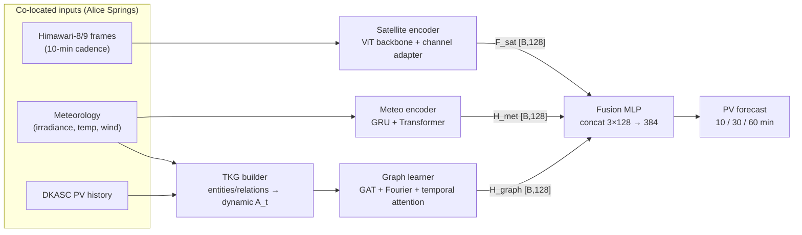

# TKG Solar Power Forecasting — Paper Reproduction

[](pyproject.toml)
[](https://pytorch.org/)
[](https://colab.research.google.com/github/DucLong06/tkg-solar-satellite-reasoning/blob/main/notebooks/colab_train.ipynb)
[](tests/)

Reproduction of *"Temporal Knowledge Graph Reasoning for Real-Time Solar Power
Forecasting Using Satellite Data"*. A multi-modal pipeline that fuses
**satellite imagery + meteorology + a temporal knowledge graph** to forecast PV
power at **10 / 30 / 60-minute horizons**, runnable end-to-end with a single
`python main.py`.

## Highlights

- **Co-located real data** — PV, weather, and satellite all cover the same site
  (Alice Springs, Australia), so the TKG's spatio-temporal edges are physically
  meaningful.
- **Three encoders, one contract** — satellite, meteorology, and graph branches
  each emit a 128-dim embedding (pinned in [`src/common/shapes.py`](src/common/shapes.py))
  before fusion.
- **Reproducible by design** — deterministic seeds, shape tests, no-NaN/grad
  tests, resumable training with self-healing checkpoints.
- **Runs anywhere** — synthetic smoke data for CPU wiring checks; full training
  on Colab GPU via ready-made notebooks.

## Architecture



## Data sources

| Source | What | How it's fetched |
|--------|------|------------------|
| [DKASC Alice Springs](https://dkasolarcentre.com.au/) | PV master-meter output (2020–2023), cleaned to a canonical UTC schema | `scripts/download_dkasc.py` → `scripts/build_dkasc_clean_csv.py` |
| Himawari-8/9 AHI | Satellite reflectance frames over Alice Springs, 10-min cadence, from the AWS open-data archive (Himawari-8 through 2022-12-13, Himawari-9 after) | `scripts/download_himawari.py` / `scripts/build_himawari_frames.py` |
| ERA5 (via Open-Meteo) | Wind backfill — the site anemometer is dead after 2016 | `scripts/build_dkasc_clean_csv.py` (automatic) |

All three modalities are geographically **co-located**, unlike an earlier
iteration of this reproduction that mixed European PV with Asian satellite data.

**Fixed benchmark split:** train 2020-01 → 2022-06 · val 2022-07 → 2022-12 ·
test **2023 (full year)**. Baselines share the satellite-aligned windows and
scaler with **TKG-Solar**, so the comparison is same-condition.

## Repository layout

| Component | Path | Role |
|-----------|------|------|
| Data pipeline | `src/data_pipeline/` | load → align → clean → scale → window → split |
| Metrics | `src/metrics/` | MAE / RMSE / MAPE (inverse-scaled) |
| Training | `src/training/` | train loop, config, evaluate, resumable checkpoints |
| LSTM baseline | `src/lstm_baseline/` | LSTM baseline forecaster |
| Meteo encoder | `src/meteo_encoder/` | meteo sequence → `H_met [B,128]` (GRU + Transformer) |
| Satellite encoder | `src/satellite_encoder/` | satellite frames → `F_sat [B,128]` (frozen ViT + channel adapter) |
| TKG builder | `src/tkg_builder/` | entities/relations → dynamic adjacency `A_t` |
| Graph learner | `src/graph_learner/` | GAT + Fourier + temporal attention → `H_graph [B,128]` |
| Fusion predictor | `src/fusion_predictor/` | concat 3×128 → MLP → `[B,3]`; full `TKGSolarModel` |
| Advanced loss | `src/advanced_loss/` | probabilistic + physics-informed composite loss |

## Quick start

```bash
# 1. Environment (uv; CPU torch index is configured in pyproject.toml)
uv sync --extra dev

# 2. Data — pick ONE:
#    (a) Synthetic smoke data (no keys, runs anywhere):
uv run python scripts/generate_synthetic_data.py --days 30

#    (b) Real co-located data (DKASC + Himawari-8/9):
uv run python scripts/download_dkasc.py --start 2020-01-01 --end 2023-12-31
uv run python scripts/build_dkasc_clean_csv.py \
    --raw data/dkasc/96-Site_DKA-MasterMeter1.csv \
    --out data/dkasc/alice_2020_2023_clean.csv
uv run python scripts/build_himawari_frames.py --start 2020-01-01 --end 2020-01-07

# 3. Run
uv run python main.py --config configs/smoke_config.yaml   # fast end-to-end check
uv run python main.py --config configs/paper_config.yaml   # full run (GPU recommended)

# 4. Baselines only (no satellite data needed)
uv run python scripts/run_baselines.py --config configs/paper_config.yaml --no-sat

# 5. Tests (determinism + shapes + no-NaN/grad)
uv run pytest
```

## Notebooks

| Notebook | Purpose |
|----------|---------|
| [`colab_train.ipynb`](notebooks/colab_train.ipynb) | Clone-and-run on Colab GPU: mount Drive data → train → evaluate → save checkpoints |
| [`colab_eval_only.ipynb`](notebooks/colab_eval_only.ipynb) | Benchmark existing checkpoints without retraining |
| [`data_pipeline_walkthrough.ipynb`](notebooks/data_pipeline_walkthrough.ipynb) | Step-by-step data pipeline (load → align → clean → split → clip → scale → window) with formulas |
| [`results_analysis.ipynb`](notebooks/results_analysis.ipynb) | Predicted-vs-actual analysis and per-horizon error breakdown |

## Results

Same-condition benchmark on DKASC Alice Springs — **test = full year 2023**
(train 2020-01→2022-06, val 2022-07→12). All models share the
satellite-aligned windows, scaler, and seed; metrics are inverse-scaled kW.

| # | Model | MAE (kW) | RMSE (kW) | MAPE % |
|---|-------|----------|-----------|--------|
| 1 | Temporal-GNN | **11.47** | 21.04 | 24.90 |
| 2 | **TKG-Solar** (frozen ViT) | 11.90 | **20.37** | **24.10** |
| 3 | GRU | 12.32 | 21.61 | 26.45 |
| 4 | LSTM | 12.77 | 22.03 | 27.35 |
| 5 | Transformer | 13.00 | 22.46 | 27.63 |
| 6 | ARIMA | 18.78 | 35.50 | 38.36 |
| 7 | Persistence | 20.96 | 30.54 | 40.07 |

**TKG-Solar** has the **best RMSE and MAPE of all models** and is second on
MAE (−0.42 kW vs Temporal-GNN), beating GRU/LSTM/Transformer. No overfit:
val MAE 13.79 vs test MAE 11.90, with early stopping (epoch 22).

TKG-Solar per-horizon (test 2023): 10 min MAE 8.99 · 30 min 11.89 · 60 min
14.80 kW.

> Pending: Run B (unfreeze last 2 ViT blocks) and the ±sat/±graph/±meteo
> ablation. Absolute values are not comparable to the paper's (different site,
> scale, and time span) — relative ordering is the target.

## Compute note

Local development is CPU-only. The full training run (per-frame ViT +
per-timestep GAT) needs a GPU — train on Colab (see
[`colab_train.ipynb`](notebooks/colab_train.ipynb)) or an SSH GPU box. The
smoke config keeps the model tiny so `python main.py` finishes in seconds for
wiring verification.
